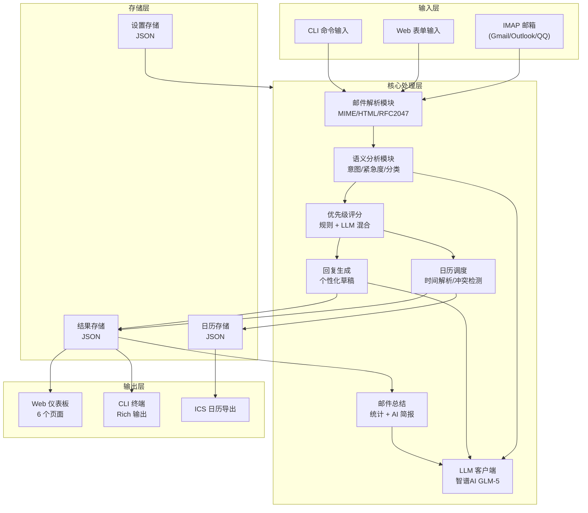
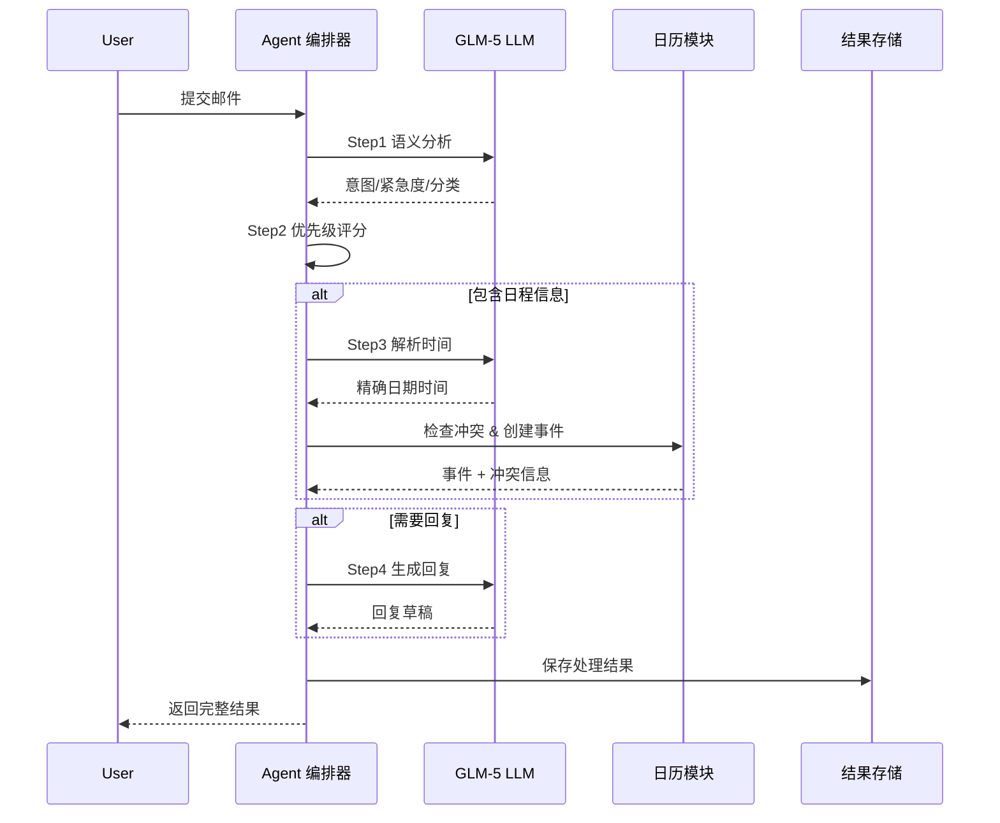
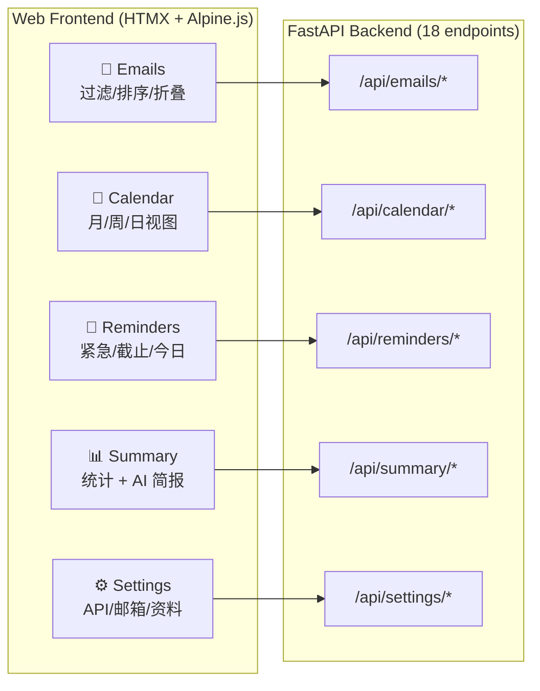
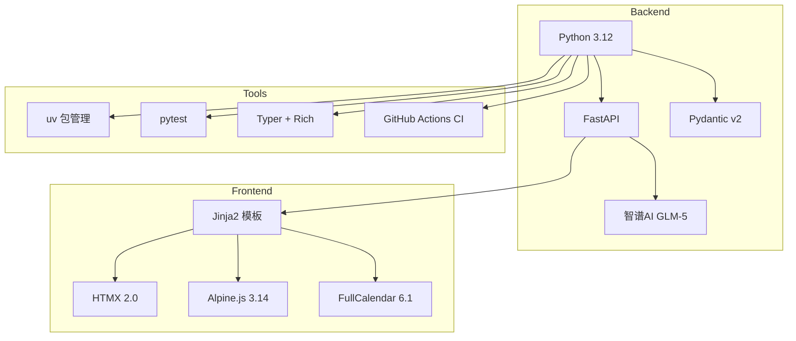

# 邮件管理代理系统（Mail Agent）中期报告

**计22 张翔宇 2022012081**

**GitHub 仓库**：https://github.com/Painkillerzzz/MailAgent

---

## 一、项目概述

本项目开发一个**基于大模型（智谱AI GLM-5）的邮件管理代理系统**，自动理解邮件内容并协助完成邮件分类、优先级判断、日历调度、回复生成和邮件总结。系统提供 CLI 命令行和 Web 仪表板两种交互方式。

---

## 二、系统架构

### 2.1 整体架构



### 2.2 邮件处理流水线



---

## 三、已完成功能

### 3.1 核心模块实现

| 模块 | 功能描述 | 技术实现 |
|------|---------|---------|
| 邮件解析 | MIME 解析、HTML→文本、RFC 2047 解码、附件提取 | Python email 标准库 |
| 语义分析 | LLM 分析邮件意图（10 类）、紧急度（4 级）、分类（6 类） | GLM-5 + JSON 结构化输出 |
| 优先级评分 | VIP 发件人检测 + 截止日期权重 + 意图权重 + 紧急度权重 | 规则引擎 + LLM |
| 日历调度 | LLM 时间解析、冲突检测、事件 CRUD、ICS 导出 | dateutil + icalendar |
| 回复生成 | 基于上下文和用户风格的个性化回复草稿 | GLM-5 Prompt Engineering |
| 邮件总结 | 统计数据生成 + LLM 智能简报 | 规则统计 + GLM-5 |
| IMAP 获取 | 支持 SSL 连接、未读邮件拉取 | Python imaplib |

### 3.2 Web 仪表板（6 个页面）



**技术栈**：Jinja2 服务端渲染 + HTMX 局部更新 + Alpine.js 客户端交互 + FullCalendar.js 日历组件，零构建步骤（CDN 引入）。

**页面功能**：

- **Emails**：按紧急度/分类/意图过滤，按优先级/日期排序，卡片点击展开详细分析和回复草稿
- **Calendar**：FullCalendar 月/周/日三视图，事件按紧急度着色，冲突红色边框，点击弹窗查看详情
- **Reminders**：三栏布局（紧急邮件/即将截止/今日日程），30秒自动刷新，导航栏实时徽章
- **Summary**：5 项统计指标卡片 + 分类/紧急度分布表 + 一键 AI 简报生成
- **Settings**：LLM API Key 配置与测试、IMAP 邮箱配置与连接测试、用户资料与回复风格

### 3.3 CLI 命令行工具（6 个命令）

| 命令 | 功能 |
|------|------|
| `mail-agent demo` | 处理 3 封预设示例邮件，展示完整流程 |
| `mail-agent fetch` | 从 IMAP 邮箱拉取未读邮件并处理 |
| `mail-agent analyze` | 分析手动输入的单封邮件 |
| `mail-agent calendar` | 查看日历事件，支持 `--export` 导出 ICS |
| `mail-agent summary` | 生成统计摘要，`--verbose` 触发 AI 简报 |
| `mail-agent web` | 启动 Web 仪表板 |

---

## 四、项目规模

### 4.1 代码统计

```
模块                      代码行数    占比
──────────────────────────────────────────
Web 层 (FastAPI/API/存储)    738    ████████████▎      27.6%
语义分析 + 总结 + 优先级      386    ██████▍            14.4%
日历 (存储/调度/ICS)         325    █████▍             12.2%
CLI 界面 (Typer/Rich)       317    █████▎             11.9%
邮件 (获取/解析)             300    █████              11.2%
数据模型 + 配置              265    ████▍               9.9%
回复生成                     121    ██                  4.5%
LLM 客户端                   80    █▎                  3.0%
前端模板 (HTML)             584    ─── (独立统计)
前端资源 (CSS/JS)           553    ─── (独立统计)
──────────────────────────────────────────
Python 源码合计            2,672 行
测试代码                   2,021 行
前端代码                   1,137 行
项目总计                   5,830 行
```

### 4.2 测试覆盖

```
测试文件                    测试数    覆盖模块
──────────────────────────────────────────────
test_web_api.py               24    Web 页面 + 18 个 API 端点
test_email_parser.py          21    MIME/HTML/RFC2047 解析
test_calendar_store.py        15    日历 CRUD + 冲突检测
test_priority.py              14    优先级评分规则
test_models.py                14    9 个 Pydantic 数据模型
test_result_store.py          14    结果过滤/排序/持久化
test_settings_store.py        10    设置脱敏/覆盖/集成
test_config.py                 8    配置加载/环境变量
test_analyzer.py               8    LLM 语义分析 (集成)
test_llm_client.py             8    GLM-5 API 调用 (集成)
test_ics_export.py             6    ICS 格式导出
test_reply_generator.py        6    回复生成 (集成)
test_orchestrator.py           5    全流程编排 (集成)
test_scheduler.py              5    日历调度 (集成)
test_summarizer.py             5    邮件总结统计
──────────────────────────────────────────────
合计                         163    全部模块覆盖
```

其中标注"集成"的测试使用真实智谱AI API 进行端到端验证。

---

## 五、Demo 演示

### 5.1 Demo 邮件处理流程

系统运行 `mail-agent demo` 处理 3 封示例邮件，输出如下：

| 邮件 | 意图识别 | 紧急度 | 优先级分 | 日历事件 | 生成回复 |
|------|---------|--------|---------|---------|---------|
| Prof. Lee: Meeting | meeting_request | medium | 10.0 (CRITICAL) | 4/16 15:00-16:00 | "Thursday at 3pm works well..." |
| John: Submit draft by Friday | task_assignment | high | 9.5 (HIGH) | 4/17 17:00-18:00 | "I'll submit by Friday EOD..." |
| arXiv: Paper accepted | notification | low | 1.0 (LOW) | — | — |

**处理流程示例**（以 Prof. Lee 的会议邮件为例）：

```
Step 1: 邮件语义分析
  → 意图=meeting_request, 紧急度=medium, 需要回复=True, 包含日程=True
Step 2: 优先级评分
  → VIP sender (+3.5); deadline related (+1.5); intent=meeting (+3.0); urgency=medium (+2.0)
  → 总分=10.0, 等级=CRITICAL
Step 3: 日历调度
  → 创建事件: Meeting with Prof. Lee (2026-04-16 15:00 - 16:00)
Step 4: 生成回复
  → "Dear Prof. Lee, Thursday at 3pm works well for me..."
```

---

## 六、Prompt 设计

系统使用 4 个核心 Prompt：

| Prompt | 用途 | 温度 | 输出格式 |
|--------|------|------|---------|
| 邮件分析 Prompt | 提取意图、紧急度、分类、日程信息 | 0.1 | JSON |
| 时间解析 Prompt | 将自然语言时间转为 ISO 日期 | 0.0 | JSON |
| 回复生成 Prompt | 基于上下文生成个性化回复 | 0.7 | 纯文本 |
| 总结简报 Prompt | 生成每日邮件简报 | 0.3 | 结构化文本 |

低温度用于需要精确结构化输出的场景（分析、时间解析），高温度用于需要自然多样性的场景（回复生成）。

---

## 七、技术栈



---

## 八、后续计划

| 功能 | 说明 | 优先级 |
|------|------|--------|
| Google Calendar 集成 | OAuth 授权 + 事件双向同步 | 高 |
| 邮件任务追踪 | Agent 自动提醒 deadline，跟踪任务状态 | 高 |
| SMTP 邮件发送 | 审批回复草稿后自动发送 | 中 |
| 多工具 Agent | Slack / Notion / Google Docs 集成 | 低 |

---

## 附录

### A. 项目目录结构

```
MailAgent/
├── src/mail_agent/
│   ├── config.py              # 配置管理
│   ├── models.py              # 9 个 Pydantic 数据模型
│   ├── llm/client.py          # 智谱AI GLM-5 客户端
│   ├── email/
│   │   ├── fetcher.py         # IMAP 邮件获取
│   │   └── parser.py          # 邮件解析
│   ├── understanding/
│   │   ├── analyzer.py        # LLM 语义分析
│   │   ├── priority.py        # 优先级评分
│   │   └── summarizer.py      # 邮件总结
│   ├── calendar/
│   │   ├── store.py           # 本地日历存储
│   │   ├── scheduler.py       # 日历调度
│   │   └── ics_export.py      # ICS 导出
│   ├── reply/generator.py     # 回复生成
│   ├── agent/orchestrator.py  # Agent 编排器
│   ├── cli/app.py             # CLI (6 commands)
│   └── web/
│       ├── app.py             # FastAPI 主应用
│       ├── api.py             # 18 个 API 端点
│       ├── result_store.py    # 结果持久化
│       └── settings_store.py  # 设置持久化
├── web_templates/             # 6 个页面 + 4 个 HTMX 局部模板
├── static/                    # CSS + JS (HTMX/Alpine/FullCalendar)
├── tests/                     # 15 个测试文件, 163 个测试用例
├── .github/workflows/ci.yml   # GitHub Actions CI
└── pyproject.toml             # uv 项目配置
```

### B. 邮件分析 Prompt 示例

```
System: You are an email analysis assistant. Analyze the given email
and extract structured information.

You MUST respond with a valid JSON object containing exactly these fields:
{
  "intent": one of ["meeting_request", "task_assignment", "deadline_reminder",
    "information_sharing", "cooperation_request", "social", "notification",
    "inquiry", "reply_expected", "other"],
  "urgency": one of ["critical", "high", "medium", "low"],
  "category": one of ["meeting", "task", "cooperation", "notification",
    "social", "other"],
  "requires_reply": true or false,
  "contains_schedule": true or false,
  "schedule_description": "description of any time/date mentioned",
  "summary": "one sentence summary",
  "key_points": ["list", "of", "key", "points"]
}
```

### C. 优先级评分公式

```
priority_score = sender_weight + deadline_weight + intent_weight + urgency_weight

sender_weight:   VIP 域名 (+2.0) + VIP 头衔关键词 (+1.5)
deadline_weight: 含日程 (+1.5) + deadline 意图 (+2.0) + deadline 关键词 (+1.0)
intent_weight:   task_assignment (3.5) > deadline_reminder (4.0) > meeting (3.0) > ...
urgency_weight:  critical (5.0) > high (3.5) > medium (2.0) > low (0.5)

等级映射: ≥10 → CRITICAL, ≥7 → HIGH, ≥4 → MEDIUM, <4 → LOW
```
