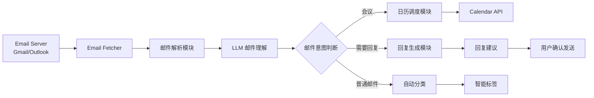
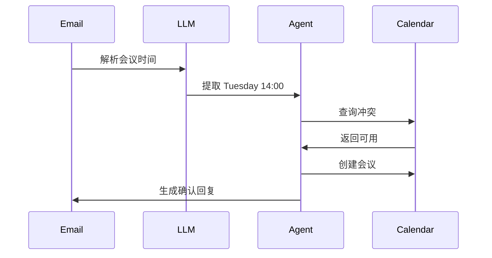

# 邮件管理代理 (Application Track No. 6) 设计报告

计22 张翔宇 2022012081 xinagyuz22@mails.tsinghua.edu.cn

---

# 一、待解决的问题

在科研、工作或团队协作环境中，用户每天会收到大量邮件，例如会议通知、任务安排、合作请求、系统通知和普通交流邮件。

这些邮件存在几个常见问题：

1. **信息过载**：用户每天需要手动浏览大量邮件。
   
2. **优先级难以判断**：邮件的紧迫性不同，但传统邮箱只能依赖简单规则或手动标记。
   
3. **回复成本高**：许多邮件需要查找历史上下文、组织礼貌语言、确认时间安排。
   
4. **日程管理割裂**：安排通常需要用户手动打开日历、创建事件，然后回复邮件确认。

因此，本项目希望开发一个 **基于大模型的邮件管理代理（Email Agent）**，自动理解邮件内容并协助完成以下任务：

- 邮件意图识别
- 紧急程度判断
- 自动分类
- 日程任务拆解
- 调用日历工具
- 生成个性化回复建议

---

# 二、系统核心能力

本系统的目标能力包括：

### 1 邮件语义理解

利用 LLM 分析邮件：邮件意图、紧急程度、是否需要回复、是否涉及日程

示例：

| 邮件内容                          | 判断     |
| --------------------------------- | -------- |
| Could we meet tomorrow afternoon? | 会议请求 |
| Please submit the draft by Friday | 截止任务 |
| FYI: paper accepted               | 通知     |

---

### 2 智能邮件分类

根据语义进行分类，例如：会议、任务、合作、通知、社交；而不是仅靠发件人和关键词。

---

### 3 自动任务拆解

例如邮件：

> Let's meet next Tuesday at 2pm to discuss the paper.

Agent 会自动拆解为：

1. 检查日历是否冲突
2. 确认用户时间
3. 创建会议事件
4. 生成回复确认
5. 生成处理简报

---

### 4 日历自动调度

Agent 可以调用 Google Calendar API 等工具，完成查询空闲时间、创建会议、修改会议等功能。

---

### 5 个性化邮件回复

基于历史邮件上下文、发件人关系、用户语气风格，生成自然回复，例如：

> Hi Prof. Smith,
>
> Tuesday at 2pm works well for me. I look forward to discussing the draft.
>
> Best,
> Xiangyu

---

# 三、系统整体架构



------

# 四、系统模块设计

## 1 邮件获取模块

负责连接真实邮箱，支持 Gmail API、Outlook API、IMAP，功能有拉取新邮件、获取邮件正文、提取附件。

示例：

```
IMAP fetch unread emails
```

输出：

```
{
 sender
 subject
 body
 time
 thread_id
}
```

------

## 2 邮件理解模块（LLM）

利用大模型理解邮件语义。

输入：

```
Subject: Meeting request
Body: Could we meet tomorrow afternoon to discuss the experiment?
```

LLM 输出：

```json
{
 "intent": "meeting_request",
 "urgency": "medium",
 "requires_reply": true,
 "contains_schedule": true
}
```

------

## 3 邮件优先级判断

通过规则 + LLM 结合判断：

优先级因素：

- 发件人
- 是否有 deadline
- 是否来自导师 / 上级
- 是否会议安排

评分模型：

```
priority_score = sender_weight + deadline_weight + intent_weight
```

------

## 4 日历调度模块

如果邮件涉及时间，Agent 执行：解析时间、查询日历、创建事件。



------

## 5 回复生成模块

利用 LLM 生成自然邮件。

输入：

- 当前邮件
- 历史往来
- 用户风格

Prompt 示例：

```
You are an assistant helping manage emails.

Given:
- email content
- sender relationship
- user's tone preference

Write a polite response.
```

输出：

```
Hi John,

Thanks for the invitation. Tuesday afternoon works well for me.

Best,
Jeremy
```

------

# 五、Prompt 设计

### 邮件理解 Prompt

```
You are an email assistant.

Extract:

1. intent
2. urgency
3. whether reply is required
4. whether calendar action is needed

Email:
{email_body}
```

------

### 回复生成 Prompt

```
You are helping write a professional email reply.

Context:
- sender relationship
- previous emails
- user tone: polite and concise

Generate a reply email.
```

------

# 六、Demo 设计

示例邮件：

```
From: Prof. Lee
Subject: Meeting

Hi Xiangyu,

Can we meet Thursday at 3pm to discuss the results?

Best,
Lee
```

Agent处理：

### Step1 邮件理解

```
intent: meeting_request
urgency: medium
requires_reply: yes
time: Thursday 15:00
```

### Step2 日历检查

```
Calendar free
```

### Step3 创建事件

```
Event: Meeting with Prof. Lee
Time: Thursday 15:00
```

### Step4 生成回复

```
Hi Prof. Lee,

Thursday at 3pm works well for me. Looking forward to discussing the results.

Best,
Xiangyu
```

------

# 七、未来扩展

系统未来可以扩展：

1. **自动邮件总结**：每天生成总结，例如：3 个需要回复、2 个会议、1 个任务截止。
2. **邮件任务追踪**：例如 Agent 自动提醒 deadline。
3. **多工具 Agent**：支持 Slack、Notion、Google Docs，形成完整工作流代理。

------

# 八、总结

本项目设计了一个 **基于大模型的邮件管理代理系统**，通过结合LLM 语义理解、Agent 任务拆解、Calendar API、历史上下文回复生成，实现：智能邮件分类、自动会议安排和个性化回复建议。该系统可以显著减少用户处理邮件的时间，提高工作效率，并展示 **LLM + Agent + Skill 使用的完整应用范式**。