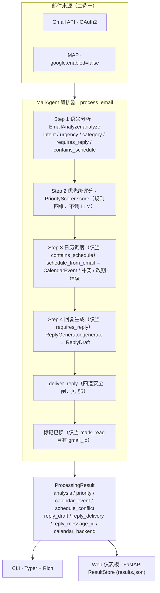
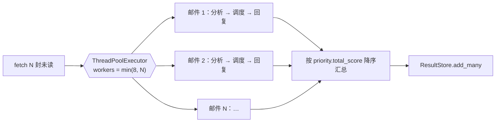
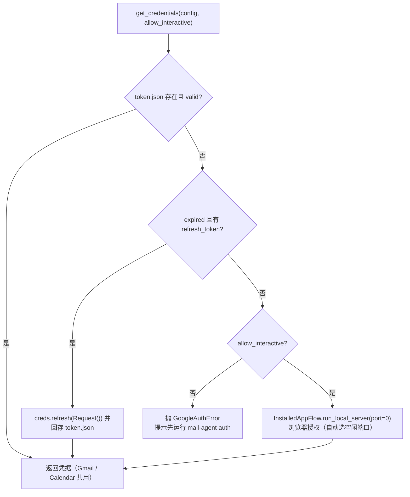
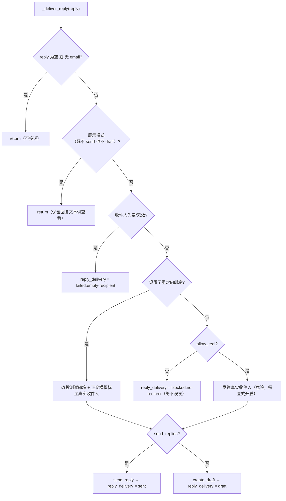

# MailAgent 项目报告

> **一句话定位**：MailAgent 是一个基于智谱 AI GLM-4.6 大模型、原生对接 Google 生态（Gmail + Calendar）的智能邮件管理代理，自动完成「语义理解 → 优先级评分 → 日历调度 → 回复生成 → 安全投递」的端到端闭环，并以「安全默认」为第一原则确保演示/测试阶段绝不误发真实邮件。

**版本**：0.2.0　|　**开发分支**：`feat/google-and-hardening`（相对 `main` 领先 19 个提交）　|　**报告日期**：2026-06-16

---

## 目录（TOC）

1. [项目概述与目标](#1-项目概述与目标)
2. [系统架构与端到端数据流](#2-系统架构与端到端数据流)
3. [核心功能模块](#3-核心功能模块)
4. [真实 Google 生态集成](#4-真实-google-生态集成gapi)
5. [安全设计（Safe-by-Default）](#5-安全设计safe-by-default)
6. [Web 展示前端](#6-web-展示前端)
7. [命令行用法（CLI）](#7-命令行用法cli)
8. [IMAP 备选通道](#8-imap-备选通道)
9. [调度评测（数据集 + Oracle）](#9-调度评测数据集--oracle)
10. [课程海报](#10-课程海报)
11. [测试与质量保障](#11-测试与质量保障)
12. [本次会话的工程改进与提交历史](#12-本次会话的工程改进与提交历史)
13. [快速开始](#13-快速开始)
14. [已知限制与后续工作](#14-已知限制与后续工作)

---

## 1. 项目概述与目标

MailAgent 是一个智能邮件管理代理系统，目标是让大模型自动理解邮件内容并完成一整套闭环处理：

- **语义理解**邮件意图（会议请求 / 任务分配 / 通知等）与紧急程度，并智能分类；
- **优先级评分**：结合发件人权重、截止日期等规则与 LLM 分析得出综合分数；
- **日历自动调度**：解析时间、检测冲突、空闲感知改期、创建事件、ICS 导出；
- **个性化回复草稿生成**（含基于空闲时段的会议改期建议）。

本次开发分支 `feat/google-and-hardening` 的核心定位是「**让 Agent 从演示/本地模拟走向真实可用**」：原生对接 Google 生态（Gmail API + Google Calendar API，OAuth2），实现读取真实未读邮件、在真实 Google Calendar 建日程、把回复存为 Gmail 草稿或直接发送、标记已读；同时进行了大量工程加固（安全默认、健壮性、可用的 Web 仪表板、并发提速、评测框架、测试与 CI、海报与文档交付物）。

| 项目元信息 | 值 |
|---|---|
| 项目名称 | `mail-agent` |
| 版本 | **0.2.0**（`pyproject.toml` 与 `src/mail_agent/__init__.py` 一致） |
| Python 版本 | `requires-python >= 3.12` |
| CLI 入口 | `mail-agent = mail_agent.cli.app:app` |
| LLM | 智谱 GLM-4.6（`ZAI_MODEL` 默认 `glm-4.6`，SDK `zhipuai>=2.1`，可配 GLM Coding Plan 端点） |
| 测试重定向邮箱 | `zhangxiangyu40@qq.com` |

**技术栈一览**：

| 层 | 技术 |
|---|---|
| 大模型 | 智谱 GLM-4.6（`zhipuai>=2.1`，支持 Coding Plan 端点 `open.bigmodel.cn/api/coding/paas/v4`） |
| 数据模型 | Pydantic v2 |
| 命令行 | Typer + Rich |
| Web | FastAPI + uvicorn + Jinja2 + HTMX + Alpine.js（CDN，无构建步骤） |
| Google | `google-api-python-client` + `google-auth-oauthlib` + `google-auth-httplib2` |
| 日历导出 | `icalendar`（ICS） |
| 并发 | `concurrent.futures.ThreadPoolExecutor`（跨邮件并发）、Starlette `run_in_threadpool`（Web 阻塞任务下沉） |
| 测试 | pytest（含 `pytest-asyncio` / `pytest-cov`） |
| 环境管理 | `uv` |

---

## 2. 系统架构与端到端数据流

MailAgent 的编排核心是 `src/mail_agent/agent/orchestrator.py` 中的 `MailAgent.process_email`，串联五步流水线：从邮件来源（Gmail 或 IMAP 二选一）进入，依次做语义分析、优先级评分、（按需）日历调度、（按需）回复生成与安全投递、（按需）标记已读，产出 `ProcessingResult`，再分别供 CLI 与 Web 仪表板展示。



**关键编排特性**：

- 每步都把人类可读说明 append 到 `processing_steps`；Step 序号根据是否含日程在 3/4 间动态切换。
- 日历调度、回复生成、投递、标记已读各自独立 `try/except`，单步失败只记日志，不中断整流程。
- `ProcessingResult` 除 `reply_delivery`（投递状态）外，还含 `reply_message_id`：投递/自检成功时回填发送出的 message id 或 Gmail 草稿 id，供前端/自验证追溯实际产物。
- Google 凭据复用：一次 `get_credentials(allow_interactive=False)` 供 Gmail 与 Calendar 共用；未授权时**降级为本地日历 + 不投递**而非崩溃。

### 批量并发模型

每封邮件相互独立、主要耗时是若干次 LLM 调用，故 `process_emails` 用 `ThreadPoolExecutor` **跨邮件并发**（默认上限 8，防限流）；**单封内部**仍按依赖顺序串行调用 LLM（回复依赖分析与冲突结果）。日历写入由 `_write_lock` 串行化避免并发双订；展示模式只读、可完全并行。实测真实拉取 5 封从「数分钟」降到约 40s（≈单封处理链耗时）。



---

## 3. 核心功能模块

### 3.1 邮件语义理解（`understanding/analyzer.py`）

`EmailAnalyzer.analyze` 用 `LLMClient.chat_json(temperature=0.1)` 把单封邮件解析成 `EmailAnalysis`，含 8 个结构化字段：`intent / urgency / category / requires_reply / contains_schedule / schedule_description / summary / key_points`。邮件正文截断到前 2000 字符再喂给模型。

**严格的 `contains_schedule` 判定**：prompt 明确要求 `be STRICT`，仅当邮件要求收件人本人在**具体时间**出席/行动（会议、电话、面试邀约带时间，或收件人本人必须达成的具体截止）才置 `true`。明确排除清单：

- 营销/促销/销售（如 `sale ends March 1`）、newsletter、活动公告；
- 招聘群发与投递窗口（如 Fall 2026 实习）；
- 自动系统通知/状态/事故/回执/安全告警；
- 模糊时间段（`this fall`）一律置 `false`，`When in doubt → false`。

**安全默认（双重兜底）**：逐字段 `data.get('field', 默认值)`；若 `chat_json` 抛任何异常，捕获后返回 `EmailAnalysis(summary='分析失败: <e>')` 而不崩溃。模型层默认值（`intent=OTHER` / `urgency=LOW` / `category=OTHER`）与代码取值默认一致，形成两层一致的安全默认。`test_prompt_enforces_strict_schedule` 断言 prompt 必须包含 `be STRICT`、`promotional`、`When in doubt, set contains_schedule = false` 三个关键字，作为约束不被改动的守护。

### 3.2 优先级评分（`understanding/priority.py`）

`PriorityScorer.score` 是**纯规则、不依赖 LLM** 的四维加权评分：`sender_weight + deadline_weight + intent_weight + urgency_weight = total_score`，并附带可读 `reasoning`。

| 维度 | 规则 |
|---|---|
| 意图权重 `INTENT_WEIGHTS` | `deadline_reminder=4.0`（最高）、`task_assignment=3.5`、`meeting_request=3.0`、`cooperation_request/reply_expected=2.5`、`inquiry=2.0`、`information_sharing=1.0`、`notification/social/other=0.5` |
| 紧急度权重 `URGENCY_WEIGHTS` | `critical=5.0` / `high=3.5` / `medium=2.0` / `low=0.5` |
| 发件人权重 | 命中 VIP 域名 +2.0、命中发件人名 VIP 关键词 +1.5（各取首个命中即 break，不叠加）；默认 VIP 域名 `tsinghua.edu.cn`/`pku.edu.cn`，关键词 `prof/professor/director/dean/boss/manager` |
| 截止权重 | `contains_schedule` 为真 +1.5；意图为 `deadline_reminder` 再 +2.0；`key_points` 命中 `deadline/due/by/before/urgent/asap` 任一 +1.0 |

**总分到等级映射**（`_score_to_level`）：`>=10` critical，`>=7` high，`>=4` medium，否则 low——**规则计算等级，独立于 LLM 给出的 `urgency`**。

**邮件简报与统计**（`summarizer.py`）：`generate_stats` 纯 Python 统计 `total/needs_reply/meetings/tasks/urgent` 及 `by_category`/`by_urgency`（无需 LLM）；`generate_briefing` 在有 LLM 时生成四段式每日简报（Overview / Action Required / Meetings & Schedule / FYI，最多取前 20 封），无 LLM 时退化为纯文本。

### 3.3 日历调度与空闲感知改期（`calendar/`）

`CalendarScheduler` 负责从邮件分析结果解析会议时间、检查冲突，并在冲突时基于工作时间窗口的空闲扫描给出改期建议。

- **`schedule_from_email(write=False)` 默认安全**：仅 `write=True` 时才调 `store.add_event` 落库，否则只构建 `CalendarEvent` 用于展示。
- **冲突不双订**：`check_conflict` 命中后，若未开启自动避让或无可行建议，直接 `return None, conflict` 不写日历。
- **冲突时填充改期建议**：`find_free_slots` 写入 `conflict.suggested_slots`，异常被捕获并降级为空。
- **`find_free_slots` 单窗口拉取**：一次性 `list_events(win_start, win_end)` 覆盖整个 `search_days` 搜索窗，避免 N+1 调用。其参考「当前时刻」`ref_now` **可注入**（默认 `datetime.now().astimezone()`），早于它的时段视为过去而不建议——注入能力让相关测试摆脱对真实时钟的依赖。
- **时区安全**：`_aware()` 给 naive datetime 补时区再比较/排序；冲突重叠统一为半开区间 `start1 < end2 and start2 < end1`（`store`、`scheduler`、`gcalendar` 三处一致），**背靠背相邻不算冲突**。
- **LLM 时间解析**：`temperature=0.0` 追求确定性，系统提示词细化自然语言时长（15min/half hour/an hour/90min），默认「仅给日期默认 09:00、无时长默认 1 小时」，以邮件 `date` 作相对日期参考。

| 空闲扫描配置（`CalendarConfig`） | 默认值 |
|---|---|
| `work_start_hour` / `work_end_hour` | 9 / 18 |
| `slot_granularity_min` | 30（下限 5 分钟） |
| `suggest_count` / `search_days` | 3 / 5 |

**本地存储 `CalendarStore`**：基于 JSON，解析失败仅 warning 并用空日历（不抛错），逐条 `model_validate` 跳过坏数据；写入走 `atomic_write_text`（先写临时文件再 `os.replace`）保证原子性。**ICS 导出**（`ics_export.py`）：`event_to_ics`/`events_to_ics`/`export_to_file`。本地 `CalendarStore` 与 `GoogleCalendarClient` 共享 `add_event`/`check_conflict`/`list_events` 接口，可在 `CalendarScheduler` 中无缝替换。

### 3.4 回复生成（`reply/generator.py`）

`ReplyGenerator.generate` 把邮件分析、日历动作与冲突信息组装成 LLM 提示并生成回复草稿。

- **冲突场景注入空闲建议**：若 `conflict.suggested_slots` 非空，提示明确告知 LLM「以下时间在用户日历上空闲，请礼貌提议其中之一作为替代」并列出具体时段；为空则回退为通用「Suggest an alternative time」。
- 系统提示规定语气匹配、简洁礼貌、只写正文不带主题/元数据；原邮件正文截断前 2000 字符，`temperature=0.7`；自动补签名并对主题做 `Re:` 前缀去重。
- `test_reply_generator.py` 用 `_CaptureLLM` 桩件确定性断言提示中含 `FREE on the user's calendar` 及具体时段字符串。

### 3.5 LLM 客户端（`llm/client.py`）

`LLMClient` 封装智谱 GLM SDK：缺 `api_key` 抛错；支持 `base_url` 覆盖以适配 **Coding Plan 专属端点**。`chat` 返回纯文本；`chat_json` **双层容错**：先去除 markdown 围栏后 `json.loads`，失败则截取首个 `{` 到末个 `}` 子串重试，彻底失败才抛带前 120 字符预览的 `ValueError`。默认 `glm-4.6`、温度 0.7、`max_tokens=1024`。

---

## 4. 真实 Google 生态集成（`gapi/`）

模块 `src/mail_agent/gapi/` 通过 OAuth2 访问真实 Gmail 与 Google Calendar，对外暴露 `GoogleAuthError`、`get_credentials`、`GmailClient`、`GoogleCalendarClient`。所有 Google 依赖均**函数内延迟导入**，未安装 Google 库时不影响 IMAP 等其它功能。

### 4.1 OAuth2 授权（`auth.py`）



**凭据双通道与裸 ID 检测**（`_build_flow`）：优先读 `credentials.json`；JSON 解析失败时若内容以 `.apps.googleusercontent.com` 结尾且不含 `{`，判定为「只粘了裸 client ID」并给修复指引；文件不存在则回退 env `GOOGLE_CLIENT_ID`+`GOOGLE_CLIENT_SECRET`。

### 4.2 Scopes 默认与覆盖（`config.py`）

| 常量 | 内容 |
|---|---|
| `FULL_SCOPES`（默认） | `gmail.modify` + `gmail.send` + `calendar` |
| `READONLY_SCOPES` | `gmail.readonly` + `calendar.readonly` |

`GOOGLE_SCOPES` 三态：空 → FULL；`readonly`/`read-only`/`ro` → READONLY；否则按逗号分隔的显式列表。**默认刻意保留 FULL_SCOPES 以向后兼容已有 token**；收紧为 readonly 属用户显式选择且需重新授权一次。`credentials.json` 路径来自 `GOOGLE_CREDENTIALS`、`token.json` 来自 `GOOGLE_TOKEN`（默认 `DATA_DIR/token.json`）、`calendar_id` 来自 `GOOGLE_CALENDAR_ID`（默认 `'primary'`）。

### 4.3 GmailClient（`gmail.py`）

- **批量拉取 + 顺序补齐**：`_fetch_by_query` 先 list 拿 id，再 `_batch_get`（`new_batch_http_request` 并发 `messages.get(format='raw')`，整体失败返回 `{}`）；随后按原始 id 顺序遍历，batch 未命中的逐封 `_get_message` 补齐（单封失败仅 warning 跳过），保证**不丢邮件且保序**。
- **写操作齐全**：`mark_read`、`add_label`、`create_draft`（带 `threadId` 归线程）、`get_draft`、`list_drafts`、`delete_draft`、`send_reply`。`_build_raw_reply` 用 `MIMEText(utf-8)` 构 RFC822，写 `In-Reply-To`/`References` 头使 Gmail 归入原线程，再 base64url 编码。

### 4.4 GoogleCalendarClient（`gcalendar.py`）

与本地 `CalendarStore` 接口同构，可直接替换进 `CalendarScheduler`。时间统一转 RFC3339，解析支持 `dateTime` 与全天 `date`，冲突判断用 `_ensure_aware` 归一时区后做精确重叠。`get_event` 把 cancelled 视为不存在，`remove_event` 异常返回 False。

### 4.5 读写回读自验证（`verify.py`）

`RoundTripVerifier` 依赖注入 gmail/calendar 客户端 + `redirect_to`，对三类写操作做「**写入 → 回读 → 校验 → 清理**」闭环：

| 闭环 | 步骤 |
|---|---|
| 日历 | `add_event` → `get_event` 校验 title/start/end → `list_events` 命中 → `remove_event` → 确认消失 |
| 草稿 | `create_draft` → `get_draft` 校验 subject/recipient/body 含 token → `list_drafts` 命中 → `delete_draft` → 确认消失 |
| 发送 | `send_reply` 到 `redirect_to` → `fetch_query('in:sent <token>')` 搜索命中 |

每步产出 `Check`，任一失败置 `VerifyResult.passed=False`。`run_all` 默认 `cleanup=True`、`include_send=False`（不真发邮件，需显式开启）。`test_verify.py` 用内存假客户端真实走闭环，负向用例确认错误写入会被检出——**不只测「能写」，还回读比对内容**。

---

## 5. 安全设计（Safe-by-Default）

安全是 MailAgent 贯穿全系统的第一原则：**所有有外部副作用的能力默认全关，必须显式开启才有副作用**。

| 构造开关（`MailAgent`） | 默认 | 含义 |
|---|---|---|
| `send_replies` | `False` | 直接发送 |
| `create_drafts` | `False` | 建 Gmail 草稿 |
| `mark_read` | `False` | 处理后标记已读 |
| `write_calendar` | `False` | 真正写入日历 |
| `allow_real` | `False` | 发给真实收件人 |

**默认测试重定向**：`allow_real=False` 时若未显式传 `redirect_to`，回退到 `config.testing.redirect_to`（默认 `zhangxiangyu40@qq.com`，环境变量 `TEST_REDIRECT_TO`），保证缺省即安全。

**`_deliver_reply` 投递决策（含四道安全闸）**：



**`_apply_test_redirect` 横幅**：在正文前注入醒目横幅（⚠️ TEST MODE，标注真实收件人、改投的测试邮箱、分隔线），把 `reply.to` 改写为测试邮箱，并在主题前缀加 `[TEST→真实目标]`。

**纵深防御**：即使开启 send/draft，仍有空收件人拦截 + `blocked:no-redirect` 兜底；`redirect_to` 在 `allow_real=False` 时强制回退测试邮箱——单点配置失误也不会误发。

**凭据与路径安全**：

- `data/settings.json` 用 `0600` 权限 + 原子写；API 返回对 `api_key`/`password` 做 `****` 脱敏。
- `credentials.json`/`token.json`/`client_secret_*.json` 已加入 `.gitignore`，经 `git check-ignore` 确认不在版本跟踪内。
- `credentials_path`/`token_path` **只接受环境变量/.env**，settings.json 中即便提供也被忽略（`load_config` 与 `settings_store` 白名单双层防护）。
- Web/Orchestrator 场景强制 `get_credentials(allow_interactive=False)`，防止服务端阻塞弹浏览器。
- **现状提醒**：工作区现实存在 `credentials.json`、`client_secret_*.json` 及 `data/` 下的 `token.json`/`settings.json` 等敏感文件——虽均被 `.gitignore` 命中、未被跟踪，但明文落盘仍是风险点，交付/共享前应确认未进入任何历史提交（见 §14）。

---

## 6. Web 展示前端

面向作业评审的「**展示型**」仪表板：把处理结果（摘要、优先级、日程/冲突、回复草稿、统计与 AI 简报、日历视图、提醒）以网页直观呈现，而非用于生产收发。技术栈 **FastAPI + Jinja2 服务端模板 + HTMX（局部刷新/轮询）+ Alpine.js（轻量状态）**，CDN 引入 `htmx@2.0.4`、`alpinejs@3.14.8`、`FullCalendar@6.1.17`，无构建步骤。**5 个页面**：`/`（邮件）、`/calendar`（日历）、`/reminders`（提醒）、`/summary`（摘要）、`/settings`（设置）。UI 已全量简体中文化。

**API 端点（统一挂 `/api` 前缀）**：

| 端点 | 方法 | 用途 |
|---|---|---|
| `/api/demo` | POST | 3 封内置样例处理 |
| `/api/emails/process` | POST | 表单单封分析 |
| `/api/emails/fetch` | POST | 拉取真实邮件（Google/IMAP），limit 钳制 1~50 |
| `/api/emails/partial` | GET | 返回 `_email_list.html` 局部 |
| `/api/calendar/events` (+ DELETE `/{id}`) | GET/DELETE | FullCalendar 事件源（按紧急度着色）/ 删除 |
| `/api/reminders/count` `/reminders/partial` | GET | 提醒徽章与三栏轮询 |
| `/api/summary` `/summary/briefing` | GET | 统计卡 / LLM 每日简报 |
| `/api/settings` `/settings/test-llm` `/settings/test-imap` | GET/POST | 脱敏读取 / 白名单保存 / 连通性自测 |
| `/api/google/status` | GET | 授权状态 |
| `/api/selfcheck` | POST | 对真实 Gmail/Calendar 跑 RoundTripVerifier |

### 6.1 本次会话修复的关键缺陷

前端原先「**基本不可用**」，本次定位并修复了三类根因（详见 §12 的 `6cc66d6`/`de2d921`/`9e1c967`/`ccc9635`）：

- **Alpine 组件全部失效（根因）**：`alpinejs@3.14.8` CDN 末尾用 `queueMicrotask` 调度 `start()`；而 `base.html` 把 `alpinejs` 排在 `app.js` 之前，`alpine:init` 在组件注册脚本执行前就触发，导致 `fetchPanel`/`calendarApp`/`settingsApp` 等 `Alpine.data` 全部错过注册——日历页、设置页整页空白，拉取面板/状态点/徽章失效。修复：**组件脚本先于 Alpine 加载**（`htmx → app.js → extra_head → alpinejs`，皆 `defer`）。
- **拉取一直「处理中」并冻结整页**：`/api/emails/fetch`（及 `selfcheck`/`process`/`test-llm`/`test-imap`）是 `async def`，却在事件循环里**同步**执行阻塞的 Gmail 拉取 + 逐封 LLM 处理（可能数分钟），冻结整个单线程事件循环 → 所有接口一起挂死。修复：仅 `await request.json()/form()` 解析请求体，随后把阻塞段用 **`run_in_threadpool` 下沉到线程池**；只读 GET 端点本身用普通 `def` 由 Starlette 线程池执行。
- **按日期排序 500**：`result_store.list_results(sort_by="date")` 在 `None`/naive/aware 日期混排时抛 `TypeError`。修复：统一归一为 tz-aware 比较键（缺失日期排到最早）。

### 6.2 展示而非操作 + 其它加固

- `_get_agent()` 固定 `MailAgent(load_config(), create_drafts=False)`；`/api/emails/fetch` 显式 `send_replies=False, create_drafts=False, mark_read=False`——「生成回复草稿文本供查看，但不推送、不发送、不标记已读」。
- **默认仅回环监听** `127.0.0.1`，局域网/远程访问需显式 `--host 0.0.0.0`。
- **配置缓存**：`load_config()` 以 `(settings.json 路径, mtime)` 为键缓存 `AppConfig`，命中返回深拷贝；保存设置后立即失效。
- **`settings_store` 三重防护**：`_ALLOWED` 键白名单 + 脱敏（`****`+后 4 位）+ `atomic_write_text(mode=0o600)`。
- **可访问性**：当前页高亮、状态点 `aria-label`、可折叠区 `role`/键盘、表单 `label` 关联、按钮 `focus-visible`；CSS 补 CJK 字体栈、提升对比度、窄屏适配。

---

## 7. 命令行用法（CLI）

基于 Typer + Rich，`no_args_is_help=True`，共 **8 个子命令**：

| 命令 | 用途 |
|---|---|
| `demo` | 处理 3 封预设示例邮件，按优先级排序展示；`-v` 显示步骤 |
| `analyze` | 通过 `--from/--subject/--body`（均必填）传入单封邮件即时分析 |
| `auth` | 完成 Google（Gmail+Calendar）OAuth2 授权，首次使用需运行一次 |
| `fetch` | 抓取并处理未读邮件（Google 或 IMAP）；`--limit/-n` 默认 10 |
| `calendar` | 查看未来 N 天日程（`--days/-d` 默认 7）；`--export/-e` 导出 .ics |
| `summary` | 从 ResultStore 读取结果生成统计表；`-v` 调 LLM 生成 AI 简报 |
| `selfcheck` | 对真实 Gmail/Calendar 跑读写回读自验证；`--send` 含真实发送（发往测试邮箱） |
| `web` | 启动 Web 仪表板；`--host/-h` 默认 `127.0.0.1`、`--port/-p` 默认 8000 |

**`fetch` 的 6 个安全开关**：`--send`（默认仅建草稿）、`--no-draft`（仅终端显示）、`--mark-read`、`--write-calendar`、`--real`（发给真实收件人，危险）、`--test-to`（覆盖测试重定向邮箱）。注意：`fetch` **没有** `--test` 开关——测试重定向是默认行为，关闭方式是显式加 `--real`（README 旧示例与此不符，见 §14）。

---

## 8. IMAP 备选通道

`src/mail_agent/email/{fetcher,parser}.py` 提供不依赖 Google OAuth 的标准 IMAP 拉取通道，定位为 **Google 之外的备选/降级方案**：仅当 `config.google.enabled=False` 时启用。

- **`IMAPFetcher`**：封装 `imaplib`（`IMAP4_SSL`/`IMAP4`，默认端口 993），`__enter__/__exit__` 上下文管理；`fetch_unread`/`fetch_all` 委托 `_search_and_fetch`（单封解析失败仅 warning 跳过）。
- **`parser`（IMAP 与 Gmail 共用下游）**：`parse_raw_email`、RFC2047 头解码、正文提取（纯文本优先、HTML 自研 `_HTMLTextExtractor` 降级）、附件名提取。`parse_date` 无 Date 头或解析失败返回 `None`（不丢邮件），naive 时间补 UTC。

`/settings/test-imap` 仅做 `connect()+disconnect()` 连通性自测。

---

## 9. 调度评测（数据集 + Oracle）

`eval/` 是「邮件 → 自动排程」能力的离线评测层。数据集、贪心 oracle 与可行性校验器**共享同一文件 `eval/schedule_dataset.py`**。

| 场景集 `SCENARIOS` | 内容 |
|---|---|
| `single_day` | 13 封单日邮件、手写自然语言正文、含 5+ 对真冲突 |
| `multi_day` | 9 封跨周一/二/三，验证跨日同点不冲突、各日内部有冲突 |
| `dense` | 12×60min 单日严重超额，必然顺延次日 |
| `adjacency` | 4 封，背靠背 10-11/11-12/12-13 不算冲突 + 一个 10:30 真冲突需避让 |

**常量**：`WORK_START=9`、`WORK_END=18`、`GRAN=15`、`SEARCH_DAYS=3`，锚定周一 `2026-06-15`。

- **Ground-Truth oracle `greedy_place`**：按收件顺序贪心放置，冲突时用 `_nearest_free` 枚举空闲槽，按 `(距期望时间绝对差, 时间先后)` 取最近——**刻意复刻 scheduler 的避让策略**，使二者落位应一致。
- **可行性校验 `validate_schedule`**：会议数 == 邮件数、两两无重叠、全部落在工作窗、每事件按 `source_email_id` 比对原始时长。
- **两条运行路径**：`eval/schedule_eval.py` 走真实 LLM 端到端；`tests/test_schedule_eval.py` 用桩替换 `parse_schedule` 绕过 LLM 做确定性回归。

> ⚠️ 评测/排程用例锚定固定日期（`2026-06-15` 等），而 `find_free_slots` 会跳过早于真实 `now()` 的时段；当系统真实时钟越过锚点日期后，scheduler 与 oracle 落位发生分歧，相关用例会失败——这是**按真实时钟的 flake**，修复方案见 §14。

---

## 10. 课程海报

`poster/` 用 `python-pptx` 程序化生成纵向大幅面课程展示海报，两个独立版本：

| 版本 | 脚本 | 特点 |
|---|---|---|
| 功能版 | `build_poster.py` | 信息密度高，6 张「每框带图」功能卡片 + 真实分析/回复示例 |
| 大字版 | `build_poster_big.py` | 所有文字 ≥44pt（`MINPT=44`），内容精简便于远观 |

**生成管线**：`python-pptx` 绘制 → 保存 pptx → `soffice --headless --convert-to pdf` → `pdftoppm -jpeg -r 200` 渲染高清 JPG。两版 JPG 均 **7087×9449 px（200 DPI）**，约 90×120cm 标准学术海报，单页。内容为顶部整宽「系统架构」横向流水线 + 6 张功能卡片；署名「张翔宇 2022012081 / xiangyuz22@mails.tsinghua.edu.cn」。

---

## 11. 测试与质量保障

采用 pytest 分层测试：纯逻辑/数据模型/解析/调度/存储/Web/Google 适配全部用桩与临时目录**离线运行**；真正发起 GLM-4.6 调用的用例由统一门控（是否存在真实 `ZAI_API_KEY`）自动跳过。

**离线实测**（`ZAI_API_KEY=test-dummy-key uv run pytest -q`，`--collect-only` 共 **247** 用例）：单元/Web/解析/存储/Google/安全等约 **208 通过**、**34 跳过**（需真实 key）；另有 **少量排程/评测的空闲时段用例**因锚定固定日期、依赖真实系统时钟，在真实时钟越过锚点后会失败（已知 flake，见 §9 与 §14，与本会话的 Web/前端改动无关）。

| 测试文件 | 用例数 | 测试文件 | 用例数 |
|---|---|---|---|
| test_web_api | 32 | test_config | 11 |
| test_google | 30 | test_scheduler | 10 |
| test_email_parser | 21 | test_settings_store | 10 |
| test_analyzer | 16 | test_reply_generator | 8 |
| test_result_store | 15 | test_llm_client | 8 |
| test_calendar_store | 15 | test_ics_export | 6 |
| test_priority | 14 | test_summarizer | 5 |
| test_models | 14 | test_orchestrator | 5 |
| test_verify | 13 | test_cli_safety | 3 |
| test_schedule_eval | 11 | | |

**关键质量机制**：

- **数据隔离**：autouse `_isolate_data_dir` 把 `DATA_DIR`/`results.json`/`settings.json`/`calendar.json` 与 `web.api._config_cache` 全部重定向到 `tmp_path`，避免污染真实用户数据。
- **占位 key 策略**：无真实 key 时注入 `ZAI_API_KEY='test-dummy-key'` 使对象可构造；真正调用的用例由 `has_real_key()` 判定后跳过。
- **两类门控**：函数级（`llm_config`/`llm_client` fixture 触发 `skip`）+ 模块级（`test_orchestrator.py` `pytestmark=skipif`）。
- **CI**（`.github/workflows/ci.yml`）：push/PR 到 main，Ubuntu + Python 3.12，`setup-uv → uv sync → uv run pytest`；`ZAI_API_KEY` 取自 secrets，无 secret 时跳过集成用例。

> 配齐真实 `ZAI_API_KEY` 后全量真实跑一遍约需 13 分钟（远高于离线约 3 秒），故日常/CI 默认走离线快路径。

---

## 12. 本次会话的工程改进与提交历史

`feat/google-and-hardening` 分支相对 `main` 领先 **19 个提交**（`git rev-list --count main..HEAD = 19`），全部作者 Painkillerzzz。

| 主题 | 提交 | 说明 |
|---|---|---|
| Google 生态接入（核心） | `7470764` feat(gapi) | 新增 `gapi/` auth/gmail/gcalendar/verify 及读写自验证（+1428 行） |
| | `c809c03` perf(gmail) | 消息批量拉取并带安全的顺序回退 |
| | `70af158` feat(config) | OAuth scopes 经 `GOOGLE_SCOPES` 可配（可降权 readonly） |
| 配置/模型/IO 基础 | `780986d` chore | 为 Google + Coding Plan 更新依赖、.env、.gitignore、README、markers |
| | `0bfca12` feat(config/models/io) | Google+Testing 配置、Gmail 字段、原子写工具 `io_utils.py` |
| 调度与编排加固 | `9bec2c2` feat(scheduling) | 空闲感知重排 + 冲突安全写入 + safe-by-default（+580 行） |
| 核心健壮性 | `dea2415` fix(core) | 健壮 Date 解析、fetcher 去重、chat_json/analyzer 加固 |
| CLI 安全默认 | `b556750` feat(cli) | auth/fetch/selfcheck，安全默认（重定向、--real、--write-calendar、loopback） |
| Web 仪表板与 API | `ee1a478` feat(web) | dashboard + API hardening（+762 行） |
| | `80108f4` perf(web) | 按 settings.json mtime 缓存 load_config |
| 评测框架 | `7078f0d` feat(eval) | 调度评测 harness（dataset + oracle + validators） |
| 测试与 CI | `97d316c` test/ci | 全局 data 隔离、无 key 跳过 integration、单步健壮 CI |
| | `051682e` test(reply) | 回复中空闲时段建议的确定性测试 |
| 文档/海报 | `80401ed` docs | 课程 poster（功能版 + 大字版）与中期报告（+1031 行） |
| 项目报告 | `c989c16` docs | 本报告首版（多智能体调研 + 事实核查定稿） |
| **前端可用性修复** | `9e1c967` fix(web/calendar) | 按日期排序 500（None/naive/aware 混排）+ `find_free_slots` 可注入时钟 |
| | `6cc66d6` refactor(web) | **修复失效的 Alpine 前端**（脚本顺序根因）+ 全量中文 UI + 可访问性 |
| **性能与并发** | `de2d921` fix(web) | 阻塞任务下沉线程池：拉取不再冻结整个仪表板 |
| | `ccc9635` perf(agent) | `process_emails` 跨邮件并发（线程池，默认上限 8）；写入加锁防双订 |

**性能优化要点**：Gmail 批量拉取消除 N+1、`find_free_slots` 单窗口拉取、Web `load_config` 按 mtime 缓存、`/api/calendar/events` 一次性建索引、**跨邮件并发处理**（5 封实测从数分钟 → ~40s）、**Web 阻塞任务下沉线程池**（事件循环不再被冻结）。

---

## 13. 快速开始

```bash
# 1. 用 uv 安装依赖（项目约定：用 uv 而非 pip）
uv sync

# 2. 配置环境变量（复制 .env.example 为 .env 并填写）
#    必填：ZAI_API_KEY（智谱 GLM）；可选 ZAI_BASE_URL（Coding Plan 端点）
#    Google：GOOGLE_ENABLED=true + credentials.json（放项目根）

# 3. 首次完成 Google OAuth2 授权（拉起本地浏览器）
uv run mail-agent auth

# 4. 自验证真实 Gmail / Calendar 读写回读（默认不发真邮件）
uv run mail-agent selfcheck

# 5. 处理内置示例邮件（无副作用演示）
uv run mail-agent demo -v

# 6. 抓取并处理真实未读邮件（默认安全：重定向到测试邮箱、仅建草稿、不写日历）
uv run mail-agent fetch -n 10
#    覆盖重定向邮箱用 --test-to a@b.com；真实发送给原收件人需显式 --real（危险）

# 7. 启动 Web 仪表板（默认仅本机 127.0.0.1:8000）
uv run mail-agent web
#    远程/局域网访问需显式：uv run mail-agent web --host 0.0.0.0
#    （或在本地用 SSH 端口转发：ssh -L 8000:127.0.0.1:8000 user@host）

# 离线测试（无需真实 key）
ZAI_API_KEY=test-dummy-key uv run pytest -q

# 调度评测端到端（需真实 LLM 凭据）
uv run python eval/schedule_eval.py single_day
```

> **测试发邮件约定**：测试场景下所有外发回复默认改投 `zhangxiangyu40@qq.com` 并在正文标注真实目标。

---

## 14. 已知限制与后续工作

| 类别 | 问题 | 建议 |
|---|---|---|
| 测试 flake（时钟相关） | 排程/评测的空闲时段用例锚定固定日期（`2026-06-10`/`2026-06-15`），而 `find_free_slots` 跳过早于真实 `now()` 的时段；真实时钟越过锚点后这些用例失败 | 把可注入的 `ref_now` 一路透传到 `schedule_from_email` 与 eval（`find_free_slots` 已支持注入），或将数据集锚点改为相对「当前」的未来日期 |
| 功能透传 | `orchestrator` 以无参 `PriorityScorer()` 实例化，未从 config 透传 VIP 域名/关键词 | 从 `config` 注入 VIP 配置 |
| 代码陷阱 | `LLMClient.chat` 的 `temperature or default` 写法使 `temperature=0.0` 回退到 0.7（`max_tokens=0` 同理） | 改用 `is None` 判定 |
| 默认值疑似笔误 | `UserProfile.email` 默认 `'xinagyuz22@…'`（`xinagyu` 而非 `xiangyu`） | 修正拼写 |
| 测试盲点 | `_deliver_reply` 的 `blocked:no-redirect`/`empty-recipient`/横幅安全分支无 orchestrator 级直接单测（仅 `test_cli_safety` 间接覆盖） | 补 orchestrator 安全分支单测 |
| 文档出入（README） | README 仍介绍并示例 `fetch --test`/`fetch --test-to`，但 CLI 的 `fetch` **没有 `--test` 开关**——重定向是默认行为，关闭方式是 `--real`；照抄会报错 | 删除/修正该三条示例 |
| 凭据/数据明文落盘 | 工作区现存 `credentials.json`、`client_secret_*.json` 及 `data/{token,settings,results,calendar}.json`；虽被 `.gitignore` 命中且未跟踪，仍明文在盘 | 确认未进入任何历史提交，交付/共享前移除或加密 |
| 展示完整度 | 仪表板的「有趣内容」目前等同于统计 + LLM 简报，并无独立「有趣内容」字段/模块 | 评审时如实标注；如需可新增提取逻辑 |
| 端到端成本 | 配齐真实 `ZAI_API_KEY` 后全量集成测试约 13 分钟 | 保持离线快路径为默认 |
